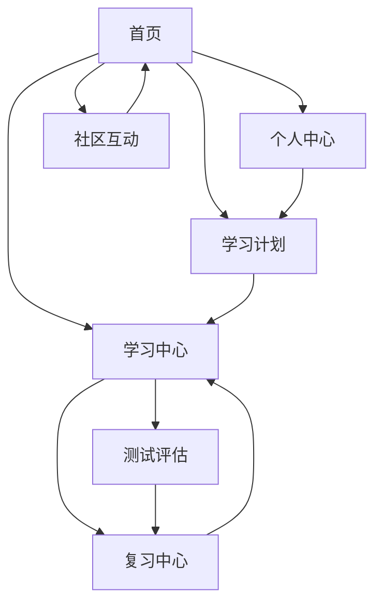

# 英语学习平台用户端产品需求文档

## 1. 产品概述

英语学习平台用户端是一个基于管理端内容的综合性英语学习Web应用，为用户提供个性化的英语学习体验。

该平台通过智能推荐系统为用户每日推送学习内容，支持用户自定义学习计划，提供多维度的学习统计分析，帮助用户系统性地提升英语水平。平台涵盖词汇学习、阅读理解、听力训练、写作练习等全方位英语技能训练，旨在打造一个高效、有趣的英语学习生态。

## 2. 核心功能

### 2.1 用户角色

| 角色 | 注册方式 | 核心权限 |
|------|----------|----------|
| 学习者 | 邮箱注册/第三方登录 | 可使用所有学习功能、查看个人数据、参与社区互动 |

### 2.2 功能模块

我们的英语学习平台用户端包含以下主要页面：

1. **首页**：每日推荐内容、学习进度概览、快速学习入口
2. **学习中心**：词汇学习、句子练习、文章阅读、听力训练、写作练习
3. **个人中心**：学习统计、学习历史、个人设置、成就展示
4. **学习计划**：计划创建、计划管理、进度跟踪
5. **复习中心**：错题本、收藏内容、复习提醒
6. **测试评估**：能力测试、阶段测试、模拟考试
7. **社区互动**：学习排行榜、打卡分享、学习小组

### 2.3 页面详情

| 页面名称 | 模块名称 | 功能描述 |
|----------|----------|----------|
| 首页 | 每日推荐 | 展示系统推荐的每日学习内容，包括单词、句子、文章等 |
| 首页 | 学习概览 | 显示今日学习进度、连续学习天数、本周学习统计 |
| 首页 | 快速入口 | 提供快速开始学习的入口按钮，直接进入学习模式 |
| 学习中心 | 词汇学习 | 单词学习、词汇测试、单词本管理、词汇复习 |
| 学习中心 | 句子练习 | 句子理解、语法分析、句子翻译、造句练习 |
| 学习中心 | 文章阅读 | 文章阅读理解、生词标注、阅读笔记、阅读测试 |
| 学习中心 | 听力训练 | 听力材料播放、听写练习、听力理解测试 |
| 学习中心 | 写作练习 | 根据主题进行写作、写作批改、写作模板学习 |
| 个人中心 | 学习统计 | 学习时长、学习内容数量、学习效果分析图表 |
| 个人中心 | 学习历史 | 历史学习记录、学习轨迹、内容回顾 |
| 个人中心 | 个人设置 | 学习偏好设置、提醒设置、账户信息管理 |
| 个人中心 | 成就系统 | 学习徽章、里程碑展示、成就进度跟踪 |
| 学习计划 | 计划创建 | 自定义学习计划、目标设定、时间安排 |
| 学习计划 | 计划管理 | 计划编辑、计划删除、计划状态管理 |
| 学习计划 | 进度跟踪 | 计划完成度、学习进度可视化、计划调整建议 |
| 复习中心 | 错题本 | 收集错误题目、错题分析、针对性复习 |
| 复习中心 | 收藏管理 | 收藏的单词、句子、文章管理和复习 |
| 复习中心 | 复习提醒 | 智能复习提醒、遗忘曲线复习安排 |
| 测试评估 | 能力测试 | 英语水平评估、弱项分析、学习建议 |
| 测试评估 | 阶段测试 | 定期学习效果检测、进步评估 |
| 测试评估 | 模拟考试 | 标准化考试模拟、考试技巧训练 |
| 社区互动 | 学习排行榜 | 学习时长排行、学习效果排行、激励机制 |
| 社区互动 | 打卡分享 | 每日学习打卡、学习心得分享、社交互动 |
| 社区互动 | 学习小组 | 创建或加入学习小组、小组学习挑战 |

## 3. 核心流程

**主要用户学习流程：**
用户登录后进入首页查看每日推荐内容，可以选择按推荐内容学习或进入学习中心选择特定模块学习。学习过程中系统自动记录学习数据，错误内容自动加入错题本。用户可在个人中心查看学习统计和历史记录，在学习计划页面制定和管理个人学习计划。复习中心提供错题和收藏内容的复习功能，测试评估帮助用户了解学习效果。社区互动增加学习的趣味性和动力。

## 4. 用户界面设计

### 4.1 设计风格

- **主色调**：蓝色系（#2196F3）作为主色，绿色（#4CAF50）作为成功/完成状态色
- **辅助色**：灰色系（#757575, #BDBDBD）用于次要信息，橙色（#FF9800）用于提醒和警告
- **按钮风格**：圆角矩形按钮，支持悬停和点击效果
- **字体**：中文使用微软雅黑，英文使用Roboto，主要字号14px-16px
- **布局风格**：卡片式布局，顶部导航栏，响应式设计
- **图标风格**：使用Material Design图标库，简洁现代

### 4.2 页面设计概览

| 页面名称 | 模块名称 | UI元素 |
|----------|----------|--------|
| 首页 | 每日推荐 | 轮播卡片展示推荐内容，包含内容预览、难度标识、学习按钮 |
| 首页 | 学习概览 | 环形进度图表、数字统计卡片、连续学习天数徽章 |
| 首页 | 快速入口 | 大型CTA按钮，渐变背景，悬浮动画效果 |
| 学习中心 | 词汇学习 | 单词卡片翻转效果、进度条、音频播放按钮、收藏星标 |
| 学习中心 | 文章阅读 | 文章阅读器界面、生词高亮、侧边笔记栏、字体大小调节 |
| 个人中心 | 学习统计 | 图表可视化（柱状图、折线图、饼图）、时间筛选器 |
| 学习计划 | 计划管理 | 时间轴布局、拖拽排序、进度环形图、状态标签 |
| 复习中心 | 错题本 | 错题卡片列表、筛选标签、复习按钮、删除操作 |
| 测试评估 | 能力测试 | 题目卡片、选项按钮、计时器、进度指示器 |
| 社区互动 | 排行榜 | 排名列表、头像展示、积分显示、奖励图标 |

### 4.3 响应式设计

平台采用移动优先的响应式设计，支持桌面端、平板端和移动端访问。移动端优化触摸交互，包括滑动切换、长按操作等手势支持。